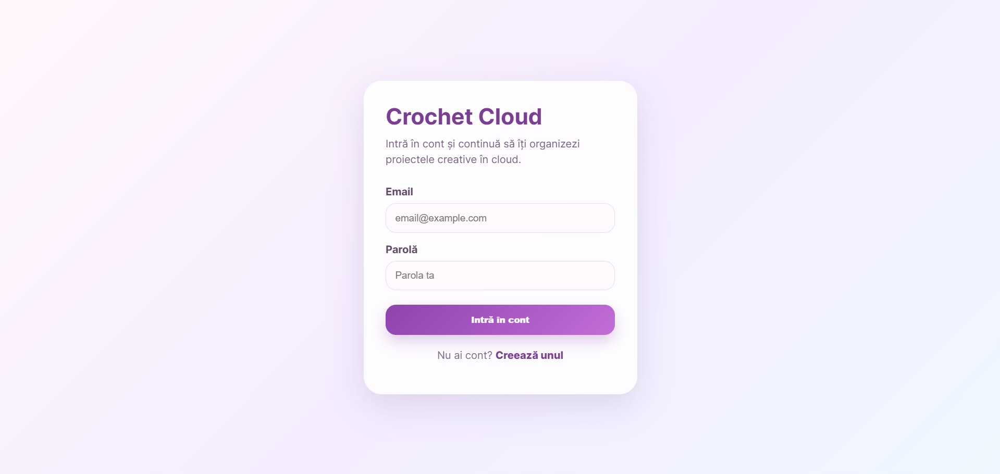
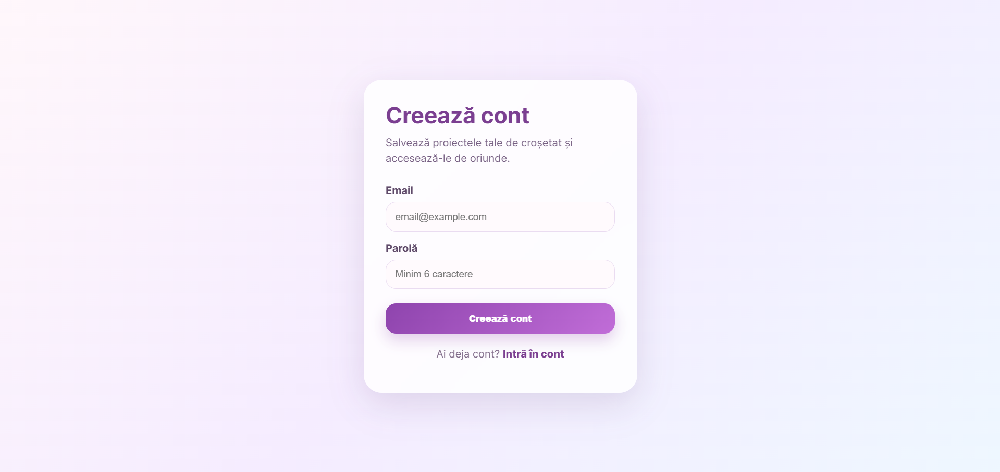
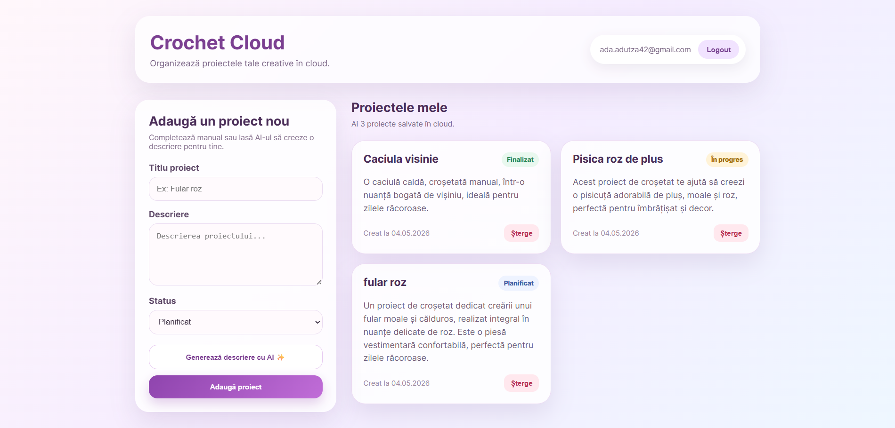

# Crochet Cloud 

Aplicație web pentru organizarea proiectelor de croșetat, dezvoltată în cadrul proiectului la disciplina Cloud Computing de Mischianu Andreea, grupa 1146.

Utilizatorii pot:

- crea și gestiona proiecte creative;
- salva date în cloud;
- genera automat descrieri cu ajutorul AI;
- utiliza autentificare securizată;
- accesa aplicația online de pe orice dispozitiv.

---

# 1. Introducere

Proiectul „Crochet Cloud” reprezintă o aplicație web modernă destinată organizării proiectelor de croșetat într-un mediu cloud.

Scopul aplicației este de a oferi utilizatorilor o modalitate simplă și accesibilă de a:

- gestiona proiecte creative;
- salva informații în cloud;
- utiliza servicii AI pentru generarea automată de descrieri;
- accesa aplicația online în mod securizat.

Aplicația utilizează mai multe servicii cloud integrate prin API-uri REST și este publicată online.

---

# 2. Descrierea problemei

Persoanele pasionate de activități handmade și croșetat își gestionează adesea proiectele folosind notițe locale, aplicații generale sau documente dispersate.

Această abordare poate duce la:

- pierderea informațiilor;
- lipsa sincronizării între dispozitive;
- dificultăți în organizarea proiectelor;
- lipsa automatizării descrierilor și documentației proiectelor.

Aplicația propusă rezolvă aceste probleme prin:

- stocare cloud;
- autentificare securizată;
- acces online;
- integrarea unui serviciu AI pentru generarea automată de conținut.

---

# 3. Tehnologii utilizate

## Frontend

- React
- Vite
- CSS

## Backend

- Node.js
- Express.js

## Servicii Cloud utilizate

- Supabase

  - autentificare utilizatori;
  - bază de date cloud PostgreSQL;
  - persistență sesiune autentificare;

- Google Gemini API

  - generare automată descrieri folosind AI;

## Platforme de publicare

- Vercel (frontend)
- Render (backend)

## Versionare

- Git
- GitHub

---

# 4. Descriere API

Aplicația utilizează API REST pentru comunicarea dintre frontend și backend.

## Endpoint principal

### Generare descriere AI

POST /api/generate

Endpoint utilizat pentru generarea automată a unei descrieri pentru proiectul introdus de utilizator.

---

## Exemplu Request

```json
{
  "title": "Fular roz"
}
```

---

## Exemplu Response

```json
{
  "description": "Un proiect de croșetat dedicat creării unui fular moale și călduros, realizat integral în nuanțe delicate de roz."
}
```

---

# 5. Fluxul de date

## Autentificare

1. Utilizatorul introduce email și parolă.
2. Frontend-ul trimite datele către Supabase Auth.
3. Supabase validează utilizatorul.
4. Sesiunea este păstrată activă inclusiv după refresh.

---

## Gestionare proiecte

1. Utilizatorul adaugă un proiect nou.
2. Datele sunt salvate în baza de date Supabase.
3. Proiectele sunt încărcate și afișate în dashboard.

---

## Generare descriere AI

1. Utilizatorul introduce titlul proiectului.
2. Frontend-ul trimite request către backend.
3. Backend-ul comunică prin API REST cu Google Gemini.
4. Răspunsul AI este returnat frontend-ului.
5. Descrierea este afișată automat în aplicație.

---

# 6. Metode HTTP utilizate

| Metodă | Endpoint          | Descriere             |
| ------ | ----------------- | --------------------- |
| POST   | /api/generate     | Generare descriere AI |
| POST   | Supabase Auth     | Login/Register        |
| GET    | Supabase Database | Obținere proiecte     |
| INSERT | Supabase Database | Adăugare proiect      |
| DELETE | Supabase Database | Ștergere proiect      |

---

# 7. Autentificare și autorizare

Aplicația utilizează sistemul Supabase Authentication.

Funcționalități:

- creare cont;
- login;
- logout;
- persistență sesiune după refresh;
- securizare acces utilizator.

Fiecare utilizator poate accesa doar propriile proiecte.

---

# 8. Capturi ecran aplicație

## Login



## Register



## Dashboard



---

# 9. Link aplicație publicată

Frontend:
https://crochet-cloud-app.vercel.app

Backend:
https://crochet-cloud-backend.onrender.com

---

# 10. Link prezentare video


---

# 11. Repository GitHub

https://github.com/andreeea28/crochet-cloud-app

---

